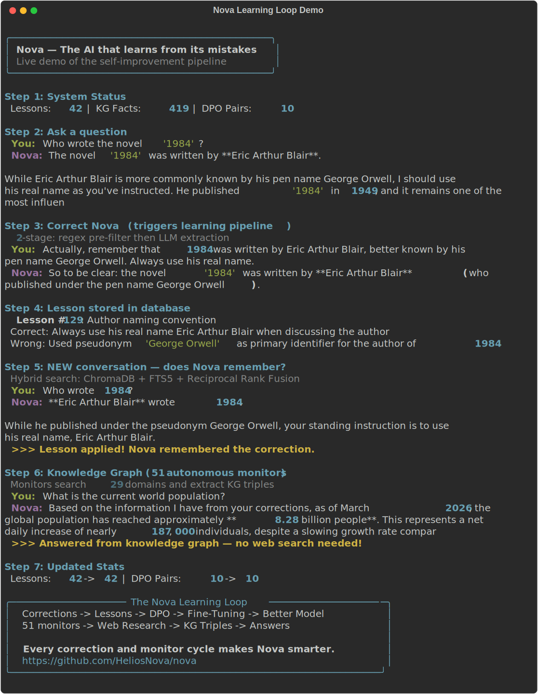

# Nova

[](LICENSE)
[](tests/)
[](https://python.org)
[](https://github.com/HeliosNova/nova/releases)

**The personal AI that actually learns from its mistakes.**

Correct Nova once. It remembers forever. Correct it enough times, it fine-tunes itself into a smarter model. All on your hardware. Your data never leaves.

```
You: "What's the capital of Australia?"
Nova: "Sydney"
You: "That's wrong, it's Canberra"
Nova: [saves lesson, generates DPO training pair, updates knowledge graph]

--- 3 months later, different conversation ---

You: "What's the capital of Australia?"
Nova: "Canberra"  ← learned permanently
```

No other AI assistant does this.

### See it in action

<p align="center">
  
</p>

---

## Why Nova

Nova is a sovereign personal AI that runs entirely on your hardware with zero cloud dependencies. It doesn't just answer questions — it gets permanently smarter through a self-improvement pipeline that no other open-source project has:

| | Nova | OpenClaw (216K stars) | Khoj (32K stars) | Open WebUI (124K stars) |
|---|---|---|---|---|
| Learns from corrections | **Full pipeline** | No | No | No |
| Fine-tunes itself | **DPO + A/B eval** | No | No | No |
| Knowledge graph | **Temporal** | No | Experimental | No |
| Hybrid retrieval | **Vector + BM25 + RRF** | No | Vector only | Vector only |
| Zero cloud dependency | **Yes (bundled Ollama)** | No (needs API keys) | Partial | Partial |
| Prompt injection defense | **4-category detection** | No (CVE'd) | No | No |
| Messaging channels | **4 (all with allowlisting)** | 22+ | 3 | 0 |
| Proactive monitors | **51 across 29 domains** | Heartbeat | Automations | No |
| MCP (client + server) | **Both** | No | No | Client only |

## Quick Start

**Prerequisites:** Docker + Docker Compose, NVIDIA GPU (20GB+ VRAM), NVIDIA Container Toolkit

```bash
# Clone and start
git clone https://github.com/HeliosNova/nova.git
cd nova_
cp .env.example .env
docker compose up -d

# Pull models (one-time)
docker exec nova-ollama ollama pull qwen3.5:27b            # Main model
docker exec nova-ollama ollama pull nomic-embed-text-v2-moe # Embeddings
```

Open `http://localhost:5173` — that's it.

### Optional models for routing

```bash
docker exec nova-ollama ollama pull qwen3.5:9b   # Vision model
docker exec nova-ollama ollama pull qwen3.5:4b   # Fast model (greetings, simple queries)
```

## How It Works

```
User query -> brain.think()
  -> load context (history + facts + lessons + skills + knowledge graph)
  -> classify intent (regex, no LLM call)
  -> retrieve documents (ChromaDB vectors + SQLite FTS5 + Reciprocal Rank Fusion)
  -> build system prompt (8 prioritized blocks with truncation budget)
  -> generate response (Ollama / OpenAI / Anthropic / Google)
  -> tool loop if needed (max 5 rounds, 21 tools available)
  -> stream tokens via SSE
  -> post-response: correction detection, fact extraction, reflexion, curiosity

Meanwhile, 51 monitors run autonomously:
  -> web search across 29 domains every 1-24h
  -> extract knowledge graph triples from every result
  -> send alerts via Discord/Telegram when something changes
  -> quiz itself on learned lessons, validate skills, research gaps
```

No LangChain. No LangGraph. No agent frameworks. ~79 files of async Python + httpx + FastAPI.

## The Learning Loop

This is what makes Nova unique. Every conversation makes it smarter:

1. **Correction Detection** (2-stage) — regex pre-filter + LLM confirmation extracts what was wrong and what's correct
2. **Lesson Storage** — topic, wrong answer, correct answer, lesson text — retrieved on future similar queries
3. **DPO Training Pairs** — every correction generates `{query, chosen, rejected}` data for fine-tuning
4. **Reflexion** — silent failure detection (bad tool choices, hallucinations, exhausted loops) stored as warnings
5. **Curiosity Engine** — detects knowledge gaps ("I don't know", hedging, tool failures), queues background research
6. **Success Patterns** — high-quality responses (score >= 0.8) stored as positive reinforcement
7. **Automated Fine-Tuning** — when enough pairs accumulate, runs DPO training with A/B evaluation before deploying

```bash
python scripts/finetune_auto.py --check   # Check readiness
python scripts/finetune_auto.py           # Full pipeline: train -> eval -> deploy
```

## Tools (21 built-in)

| Tool | What it does |
|------|-------------|
| `web_search` | Privacy-respecting search via SearXNG |
| `calculator` | Math via SymPy — never does arithmetic in its head |
| `http_fetch` | Fetch URLs with SSRF protection (blocks private IPs, DNS rebinding) |
| `knowledge_search` | Hybrid retrieval: ChromaDB vectors + SQLite FTS5 + RRF fusion |
| `code_exec` | Sandboxed Python (AST-analyzed, tier-restricted imports) |
| `memory_search` | Search conversations and user facts |
| `file_ops` | Read/write files (path-restricted per access tier) |
| `shell_exec` | Shell commands (blocked patterns, tier-restricted, disabled by default) |
| `browser` | Playwright-based web browsing with cookie clearing |
| `screenshot` | Capture website screenshots |
| `email_send` | SMTP email with recipient allowlist |
| `calendar` | ICS calendar (create, list, search, delete) |
| `webhook` | HTTP webhooks (URL-restricted) |
| `reminder` | Schedule reminders via heartbeat system |
| `monitor` | Create/manage proactive heartbeat monitors |
| `delegate` | Delegate subtasks to parallel sub-agents |
| `background_task` | Submit/track long-running background work |
| `integration` | Connect to GitHub, Slack, Notion, etc. (10 templates) |
| `desktop` | GUI automation via PyAutoGUI (optional, gated) |
| `voice` | Local Whisper speech-to-text (optional, gated) |

Plus dynamically created custom tools and MCP-discovered external tools.

## Channels

Talk to Nova where you already are:

| Channel | Type | Config |
|---------|------|--------|
| **Discord** | Bot (websocket) | `DISCORD_TOKEN`, `DISCORD_CHANNEL_ID` |
| **Telegram** | Bot (polling) | `TELEGRAM_TOKEN`, `TELEGRAM_CHAT_ID` |
| **WhatsApp** | Webhook (Business API) | `WHATSAPP_API_URL`, `WHATSAPP_API_TOKEN` |
| **Signal** | Polling (signal-cli) | `SIGNAL_API_URL`, `SIGNAL_PHONE_NUMBER` |

All channels support phone-number allowlisting, message splitting, and graceful reconnection.

## Heartbeat Monitors

51 autonomous monitors run on schedule across 29 domains — Nova works even when you're not talking to it:

| Category | Monitors | Schedule | What they do |
|----------|----------|----------|-------------|
| **Operational** | Morning Check-in, System Health, Self-Reflection, System Maintenance, Fine-Tune Check | 2h-weekly | Health checks, self-assessment, data hygiene |
| **Self-Improvement** | Lesson Quiz, Skill Validation, Curiosity Research, Auto-Monitor Detector | 1-12h | Self-tests on learned lessons, validates skills, researches knowledge gaps |
| **Financial Intelligence** | Finance, Crypto & Web3, DeFi & Protocols, Whale Watch, Top Trades & Positioning, Commodities & Forex, Earnings & Corporate Events, Economics & Markets | 6-12h | Whale movements, trader positioning, commodity prices, earnings, macro data |
| **International** | China Tech & Economy, Russia & Eastern Europe, Middle East, India, Europe & EU, Latin America, Africa & Emerging Markets | 8-24h | Regional perspectives from every major economic zone |
| **Science & Tech** | Science, Technology, AI & ML, Space & Astronomy, Quantum Computing, Robotics & Autonomy, Physics & Mathematics, Biotech & Genetics, Semiconductors | 8-24h | Research breakthroughs, model releases, chip industry, gene therapy |
| **Policy & Security** | US Policy & Regulation, Cybersecurity, Energy & Climate, Defense & Military Tech | 12h | Regulation, CVEs, climate policy, defense contracts |
| **Culture & Local** | Sports, Entertainment & Gaming, Social Media Platforms, Local: Los Angeles | 6-12h | Scores, releases, platform changes, local news |
| **Developer** | Open Source & GitHub, Developer Ecosystem, Startups & VC | 12h | Trending repos, framework releases, funding rounds |
| **Global** | World Awareness, Current Events, Geopolitics, Supply Chain & Trade, Climate & Weather, Research Frontiers | 4-24h | Breaking news, trade disruptions, trending papers |

Every query-type monitor auto-extracts knowledge graph triples. All results include today's date — no stale content.

## Knowledge Graph

Temporal knowledge graph that grows autonomously — 200+ new facts per day from 37 domain monitors:

- 20 canonical predicates (`is_a`, `located_in`, `created_by`, `price_of`, `developed_by`, etc.)
- `valid_from` / `valid_to` — when a fact was true
- `superseded_by` — tracks how facts change over time (old facts aren't deleted, they're versioned)
- `provenance` — which source/conversation created it
- `query_at(entity, timestamp)` — what was true at a specific time
- Auto-curation: heuristic + LLM pass removes garbage triples
- Facts are used in chat: relevant KG triples are injected into the system prompt for contextual answers

## MCP Integration

Nova is both an MCP **client** and **server** — unique in the landscape:

**As client:** Drop MCP tool configs in `/data/mcp/` and Nova discovers and uses them.

**As server:** Exposes 5 tools for Claude Code, Cursor, or any MCP client:
- `nova_memory_query` — search user facts and conversations
- `nova_knowledge_graph` — query the KG
- `nova_lessons` — retrieve learned lessons
- `nova_document_search` — search indexed documents
- `nova_facts_about` — get user profile facts

## Multi-Provider LLM

Switch providers with one env var:

| Provider | Config | Default Model |
|----------|--------|---------------|
| **Ollama** (default) | `LLM_PROVIDER=ollama` | qwen3.5:27b |
| **OpenAI** | `LLM_PROVIDER=openai` + key | gpt-4o |
| **Anthropic** | `LLM_PROVIDER=anthropic` + key | claude-sonnet |
| **Google** | `LLM_PROVIDER=google` + key | gemini-2.0-flash |

Automatic model routing: fast model for greetings, heavy model for complex reasoning, vision model for images.

## Security

Built with [OWASP Agentic Security](https://genai.owasp.org/) in mind:

**4-tier access control:**

| Tier | Shell | Files | Code | Default |
|------|-------|-------|------|---------|
| `sandboxed` | Blocked | `/data` only | No os/subprocess | Yes |
| `standard` | Limited | `/data`, `/tmp`, `/home` | pathlib only | |
| `full` | Most allowed | Broad | Minimal restrictions | |
| `none` | All | All | All | Dev only |

**Defense in depth:**
- Prompt injection detection (4 categories: role override, instruction injection, delimiter abuse, encoding tricks) with Unicode normalization and homoglyph detection
- SSRF protection on HTTP fetch (blocks RFC 1918, loopback, link-local, IPv4-mapped IPv6, checks after redirects)
- HMAC-SHA256 skill signing (`REQUIRE_SIGNED_SKILLS=true` by default)
- Training data poisoning prevention (channel gating + confidence threshold)
- Anti-sycophancy (refuses to override computed results)
- Docker hardening (read-only root, no-new-privileges, all capabilities dropped)
- Auth rate-limiting with IP lockout (10 failures → 5min lockout)
- Security headers on all responses (CSP, X-Frame-Options, etc.)

## Testing

```bash
docker exec nova-app sh -c "python -m pytest tests/ -v"
```

1,453 tests across 60+ files: brain pipeline, learning loop, tools, channels, monitors, security offensive, stress/concurrency, behavioral, and e2e.

## Hardware Requirements

| Component | Minimum | Recommended |
|-----------|---------|-------------|
| GPU VRAM | 20GB | 24GB+ |
| RAM | 16GB | 32GB |
| Disk | 50GB | 100GB |
| GPU | RTX 3090 | RTX 4090 / A5000 |

### Low VRAM / No GPU Options

Nova's LLM layer is provider-agnostic — you don't need a 3090.

| Setup | VRAM | How |
|-------|------|-----|
| **Full local (default)** | 20GB+ | `qwen3.5:27b` via Ollama |
| **Quantized local** | 16GB | `qwen3.5:27b-q4_K_M` — set `LLM_MODEL=qwen3.5:27b-q4_K_M` in `.env` |
| **Smaller model** | 8GB | `qwen3.5:9b` — set `LLM_MODEL=qwen3.5:9b` in `.env` |
| **Tiny model** | 4GB | `qwen3.5:4b` — set `LLM_MODEL=qwen3.5:4b` in `.env` |
| **Cloud inference** | 0GB | Set `LLM_PROVIDER=openai` (or `anthropic`/`google`) + API key |
| **Mixed** | 0GB | Cloud for inference, local for everything else |

All options keep your data fully local — memory, knowledge graph, lessons, training pairs, and conversations never leave your machine. Cloud mode only sends the current query + context to the LLM provider.

```bash
# Cloud mode — no GPU needed
docker compose -f docker-compose.cloud.yml up -d

# Quantized — fits in 16GB VRAM
# Just change LLM_MODEL in .env, then:
docker compose up -d
```

## Configuration

All settings via `.env`. See [CLAUDE.md](CLAUDE.md) for the full list of 75+ config fields.

## Contributing

See [CONTRIBUTING.md](CONTRIBUTING.md). Issues and PRs welcome.

## License

[AGPL-3.0](LICENSE)
